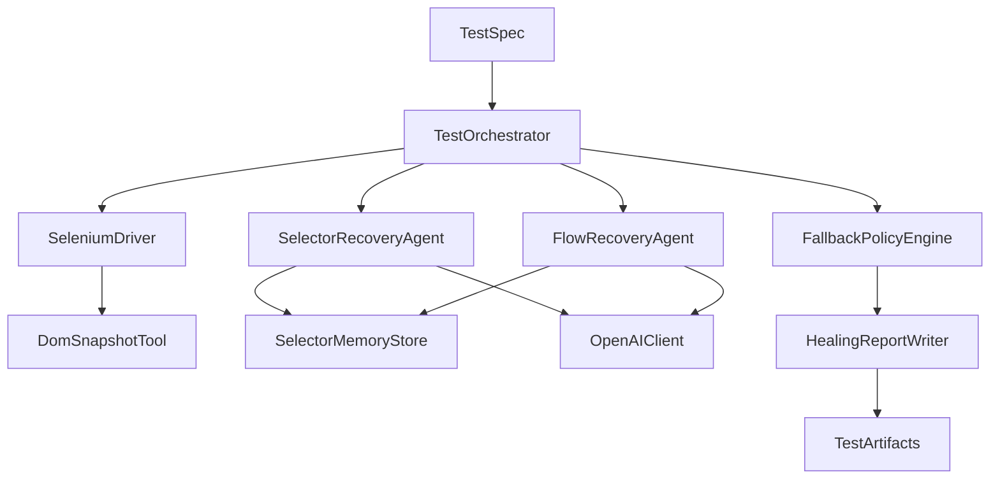

# Agentic Selenium Framework Design Document

## 1) Why This Framework Exists

You want UI automation that does not break every time a selector changes.
Traditional Selenium tests are reliable when selectors are stable, but brittle when:

- a CSS class changes,
- a button moves inside another container,
- labels or structure shift during UI redesign,
- a flow adds one extra screen (for example, consent or security prompts).

This framework adds agents on top of Selenium to make tests resilient. It keeps normal deterministic tests first, and only invokes agents when something fails. That balance gives you:

- the reliability of standard automation,
- the adaptability of LLM reasoning,
- clear governance so healing is controlled and auditable.

## 2) Goals

- Build a Java + Maven + Selenium framework.
- Use OpenAI-powered agents for selector and flow recovery.
- Auto-heal at runtime when safe, with confidence-based policies.
- Learn agent systems deeply as a QA engineer (not a black box).
- Produce rich artifacts so every heal can be reviewed and trusted.

## 3) Non-Goals (Initial Version)

- Full autonomous test generation from plain English.
- Replacing all manual test design.
- Auto-committing changed selectors directly to git without review.
- Visual diff testing as a primary healing mechanism.

## 4) Design Principles

- Deterministic first: try authored selectors and normal flow first.
- Agent as fallback: engage AI only after a concrete failure.
- Safety first: action allowlists and strict confidence gating.
- Explainability: every healing step must be logged and reproducible.
- Human override: CI can run strict mode to fail instead of heal.

## 5) High-Level Architecture



### Runtime Layers

1. **Execution Layer**: Selenium runner (JUnit/TestNG), page objects, fixtures.
2. **Agent Layer**: Selector and flow recovery agents.
3. **Policy Layer**: Confidence scoring and fail/continue decisions.
4. **Memory Layer**: Historical selector metadata and prior heal outcomes.
5. **Observability Layer**: Reports, traces, and quality dashboards.

## 6) Proposed Repository Layout

```text
self-healing-selenium/
  docs/
    agentic-selenium-framework-design.md
  src/
    main/
      java/
        core/
          TestOrchestrator.java
          PolicyEngine.java
          ConfidenceScoring.java
        agents/
          SelectorRecoveryAgent.java
          FlowRecoveryAgent.java
          AssertionHelperAgent.java
        tools/
          DomSnapshotTool.java
          AccessibilityTreeTool.java
          ScreenshotTool.java
          NetworkLogTool.java
        memory/
          SelectorMemoryStore.java
          FlowMemoryStore.java
          RunContextStore.java
        telemetry/
          HealingReportWriter.java
          EventBus.java
        types/
          Contracts.java
    test/
      java/
        e2e/
          DashboardTest.java
      resources/
        prompts/
          selector-system-prompt.md
          flow-system-prompt.md
  config/
    framework.config.json
    policy.config.json
  pom.xml
```

## 7) End-to-End Runtime Flow

1. Test step runs with authored selector.
2. If step passes, continue normally.
3. If step fails with "NoSuchElementException" or "TimeoutException", trigger Selector Recovery Agent.
4. Agent gets constrained context:
   - current URL and page title,
   - DOM subset around expected area,
   - accessibility tree,
   - historical selector candidates,
   - action intent metadata (for example `click checkout`).
5. Agent proposes ranked selector candidates with confidence.
6. Policy engine decides:
   - auto-apply,
   - retry with additional context,
   - fail-fast.
7. On apply, Selenium retries action and validates post-condition.
8. Result is logged in healing report and memory store.
9. If whole flow diverges (unexpected page), Flow Recovery Agent attempts path correction.

## 8) Core Components and Responsibilities

### 8.1 TestOrchestrator
- Wraps each Selenium action in a recoverable execution unit.
- Routes failures to correct agent type.
- Maintains per-test `RunContext` state.
- Emits events to telemetry.

### 8.2 SeleniumDriver
- Executes action primitives: click, sendKeys, select, assert, wait.
- Captures baseline errors with structured metadata.
- Exposes deterministic retries before agent fallback.

### 8.3 DomSnapshotTool
- Produces compact, token-efficient context for agents.
- Redacts sensitive values (passwords, tokens, personal data fields).
- Can return:
  - target neighborhood nodes,
  - semantic attributes (`role`, `name`, `aria-*`, `data-testid`),
  - simplified tree path.

### 8.4 SelectorRecoveryAgent
- Purpose: recover the best selector for a failed step.
- Input: failure context + DOM/accessibility summary + memory.
- Output: list of candidates with rationale and confidence.
- Constraint: can only return selectors and read-only reasoning, no arbitrary actions.

### 8.5 FlowRecoveryAgent
- Purpose: recover from path-level drift (extra modal, changed routing, reordered steps).
- Input: expected flow state, observed state, recent step history.
- Output: minimal patch plan (next allowed actions) with confidence.
- Constraint: actions must come from allowlisted verbs.

### 8.6 PolicyEngine
- Enforces governance:
  - confidence thresholds,
  - max retries,
  - strict vs adaptive execution mode.
- Prevents risky behavior in CI by policy configuration.

### 8.7 Memory Stores
- **RunContextStore (short-term):** stores context for current run only.
- **SelectorMemoryStore (long-term):** stores successful selector alternatives and decay scores.
- **FlowMemoryStore (long-term):** stores known detours and prior recoveries for similar drift.

### 8.8 HealingReportWriter
- Writes human-readable and machine-readable artifacts:
  - `healing-report.json`
  - `healing-report.md`
  - screenshots
  - before/after selector mapping

## 9) Data Contracts (Java)

```java
public record FailedStepContext(
  String testId,
  String stepId,
  String action, // "click" | "fill" | "select" | "assert"
  String expectedTargetDescription,
  String originalSelector,
  String url,
  String domExcerpt,
  String axTreeExcerpt,
  String screenshotPath,
  String errorMessage
) {}

public record SelectorCandidate(
  String selector,
  String strategy, // "role" | "label" | "testid" | "css" | "xpath"
  double confidence, // 0.0 to 1.0
  String rationale
) {}

public record SelectorRecoveryResult(
  List<SelectorCandidate> candidates,
  String recommendedSelector,
  double recommendedConfidence,
  boolean shouldRetryWithMoreContext
) {}

public record FlowRecoveryAction(
  String action, // "click" | "fill" | "waitForURL" | "assertVisible" | "dismissModal"
  String target,
  String value,
  String rationale
) {}

public record FlowRecoveryPlan(
  String planId,
  double confidence,
  List<FlowRecoveryAction> actions,
  String expectedStateAfterPlan
) {}
```

## 10) Agent Tooling Model (OpenAI)

Use a tool-calling architecture where the model does reasoning and returns typed outputs.

- **OpenAI client wrapper** handles:
  - request building,
  - schema validation,
  - retries,
  - token/cost telemetry.
- **Structured outputs** guarantee parseable candidate lists/plans.
- **Model routing**:
  - lower-cost model for simple selector retries,
  - stronger reasoning model for flow recovery.

### Tool Interface Example: Selector Recovery

Input payload:

```json
{
  "testId": "dashboard-001",
  "stepId": "click-profile",
  "action": "click",
  "expectedTargetDescription": "Profile button on dashboard",
  "originalSelector": "[data-testid='profile-btn']",
  "url": "https://retail-website-two.vercel.app/app/dashboard",
  "errorMessage": "NoSuchElementException: locate element by css selector",
  "domExcerpt": "<button aria-label='User Profile'>Profile</button>",
  "axTreeExcerpt": "button name='User Profile'"
}
```

Expected output payload:

```json
{
  "candidates": [
    {
      "selector": "//button[@aria-label='User Profile']",
      "strategy": "xpath",
      "confidence": 0.91,
      "rationale": "Accessible name matches intended action"
    },
    {
      "selector": "button.profile",
      "strategy": "css",
      "confidence": 0.67,
      "rationale": "Class partially matches but less specific"
    }
  ],
  "recommendedSelector": "//button[@aria-label='User Profile']",
  "recommendedConfidence": 0.91,
  "shouldRetryWithMoreContext": false
}
```

## 11) Healing Algorithms

*(Similar to original document...)*

## 12) Confidence and Decision Matrix

Recommended baseline thresholds (tune per app):

- `>= 0.90`: auto-heal allowed in local and CI adaptive mode.
- `0.75 - 0.89`: auto-heal in local only; CI requires strict flag override.
- `< 0.75`: fail-fast, attach diagnostics, require human review.

## 16) Learning-Centric Implementation Roadmap

## Phase 0: Baseline Selenium Skeleton
- Setup Java + Maven + Selenium project.
- Add baseline test for `https://retail-website-two.vercel.app/app/dashboard`.

*(Remaining phases outline adding orchestration, selector recovery, memory, and flow recovery...)*

## 20) Next Build Order (Actionable)

1. Bootstrap Maven Selenium project structure.
2. Add base Selenium Driver factory and `DashboardTest.java` baseline.
3. Implement `TestOrchestrator` wrapper for actions.
4. Add selector recovery MVP with OpenAI client.

